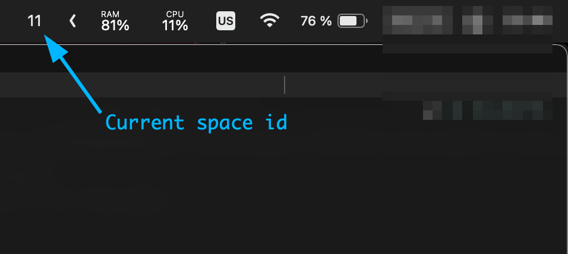
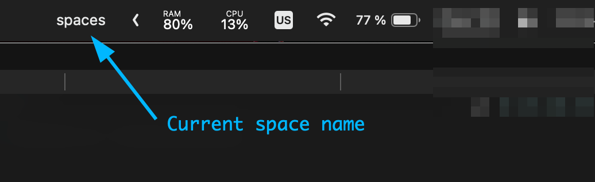
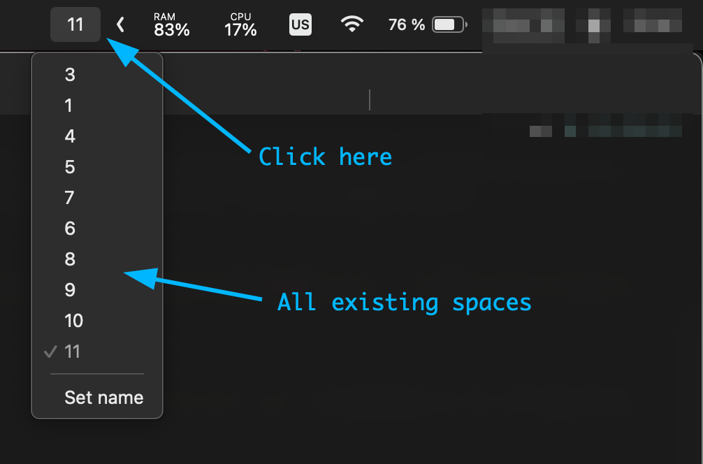
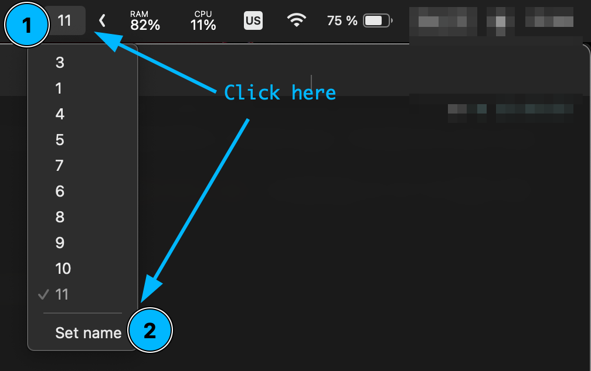
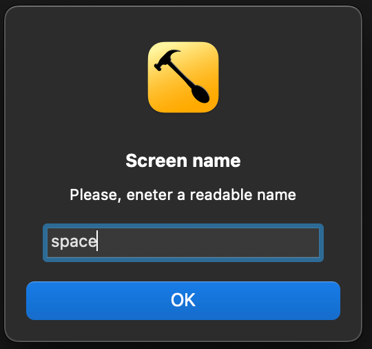
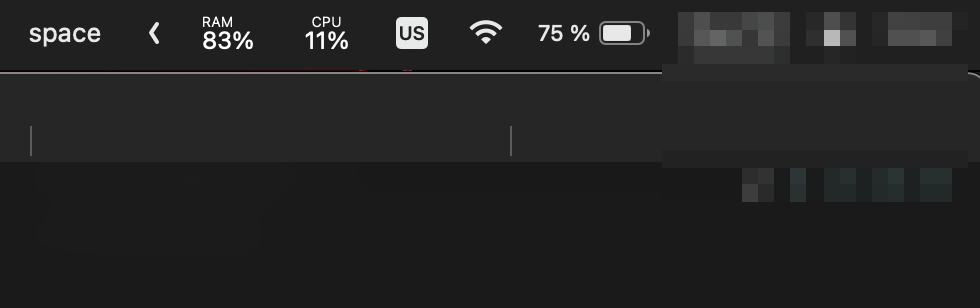
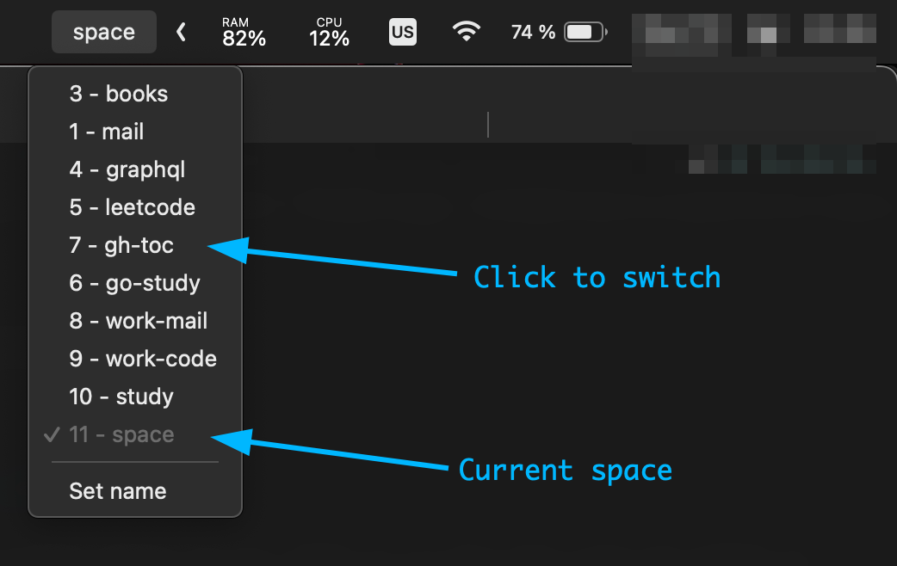

## SpaceName

Main features:
- shows current space id in the menu bar
- default name can be changed
- switch to space by name or id from menu
- save and restore positions of all windows on all screens

## Table of Contents

  * [Installation](#installation)
  * [Usage](#usage)
    * [Current space id or name](#current-space-id-or-name)
    * [Show all spaces](#show-all-spaces)
    * [Set custom name](#set-custom-name)
    * [Switch to space by id or name](#switch-to-space-by-id-or-name)
    * [Save and restore window positions](#save-and-restore-window-positions)
  * [Tests](#tests)

### Installation

SpaceName is an extension for [Hammerspoon](http://hammerspoon.org/). Once Hammerspoon is installed, you can install the SpaceName Spoon:

```sh
git clone https://github.com/ekalinin/SpaceName.git ~/.hammerspoon/Spoons/SpaceName.spoon
```

To initialize, add to `~/.hammerspoon/init.lua` (creating it if it does not exist):

```lua
spaceName = hs.loadSpoon("SpaceName")
if spaceName then
    spaceName
        :start()
        :bindHotkeys({
            -- hotkey to change current space's name
            set={{"ctrl"}, "n"},
            -- hotkey to show menu with all spaces
            show={{"ctrl"}, "m"}
        })
end
```

Reload the Hammerspoon config.

### Usage

#### Current space id or name

Right after start current space id (or name if it was set) will be shown in the menu bar:



Or current space name if it set (see below):



#### Show all spaces

Click on the space id (or name) to show all available spaces:




#### Set custom name

Choose "Set name" in menu bar to set a name for current space:



Enter new name:



Menu text will change:



#### Switch to space by id or name

Click on the space id (or name) to show all available spaces and select one to switch:



#### Save and restore window positions

Choose "Save window positions" to write the position, size and screen of
every window of every application on all screens and all spaces to
`~/.hammerspoon/SpaceName.windows.json`. Choose "Restore window positions"
to move the windows back. Windows stay on the space they are on.

macOS reports only the windows on the spaces shown right now, so both
actions visit every space on every screen through Mission Control and then
come back to the spaces that were active before. Spaces of full screen
applications are skipped. Every switch is awaited until macOS reports the
new space, which takes well under a second per space, so do not use the
mouse or keyboard until the summary alert appears. Enabling "Reduce motion"
in System Settings -> Accessibility -> Display makes the switches faster.

Positions are stored relative to the screen, so windows follow their
screen even if the arrangement of displays changed. Windows whose screen
is not connected are left where they are. A window is matched to a saved
entry by application and window id, then by application and window title,
then by application only, so restore also works after applications or the
system were restarted.

The file location and the timings of the walk (in seconds) can be changed
after loading the spoon:

```lua
spaceName.windowsFile = os.getenv("HOME") .. "/windows.json"
-- how often a switch is checked for completion
spaceName.spacePollInterval = 0.05
-- how long a single switch may take before it is given up on
spaceName.spaceSwitchTimeout = 5
-- pause after a space is shown, before its windows are read
spaceName.spaceSettleDelay = 0.2
```

### Tests

The test runs the spoon against a mocked `hs` API and needs
[LuaJIT](https://luajit.org/):

```sh
make test
```
