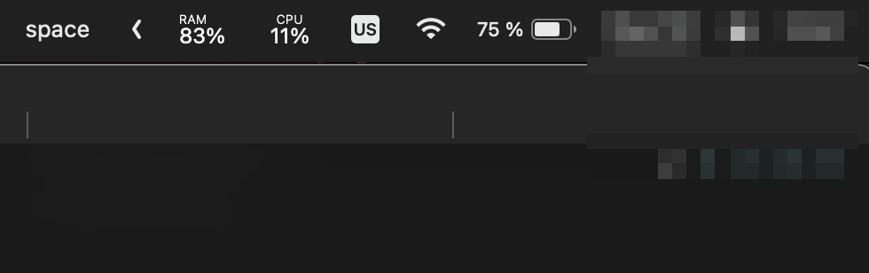

## SpaceName

Main features:
- shows current space id in the menu bar
- default name can be changed
- switch to space by name or id from menu

## Table of Contents

  * [Installation](#installation)
  * [Usage](#usage)
    * [Current space id or name](#current-space-id-or-name)
    * [Show all spaces](#show-all-spaces)
    * [Set custom name](#set-custom-name)
    * [Switch to space by id or name](#switch-to-space-by-id-or-name)

### Installation

SpaceName is an extension for [Hammerspoon](http://hammerspoon.org/). Once Hammerspoon is installed, you can install the SpaceName Spoon:

```sh
$ git clone https://github.com/ekalinin/SpaceName.git ~/.hammerspoon/Spoons/SpaceName.spoon
```

To initialize, add to `~/.hammerspoon/init.lua` (creating it if it does not exist):

```lua
spaceName = hs.loadSpoon("SpaceName")
if spaceName then
    spaceName
        :start()
        :bindHotkeys({
            -- hotkey to change current space's name
            set={{"ctrl"}, "n"},
            -- hotkey to show menu with all spaces
            show={{"ctrl"}, "m"}
        })
end
```

Reload the Hammerspoon config.

### Usage

#### Current space id or name

Right after start current space id (or name if it was set) will be shown in the menu bar:


Or current space name if it set (see below):


#### Show all spaces

Click on the space id (or name) to show all available spaces:


#### Set custom name

Choose "Set name" in menu bar to set a name for current space:


Enter new name:


Menu text will change:



#### Switch to space by id or name

Click on the space id (or name) to show all available spaces and select one to switch:


